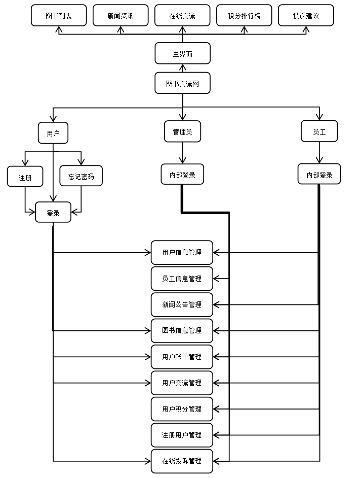
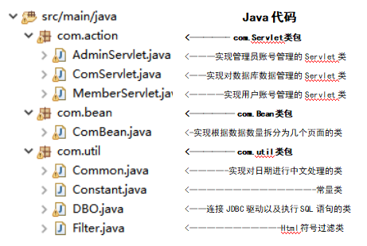
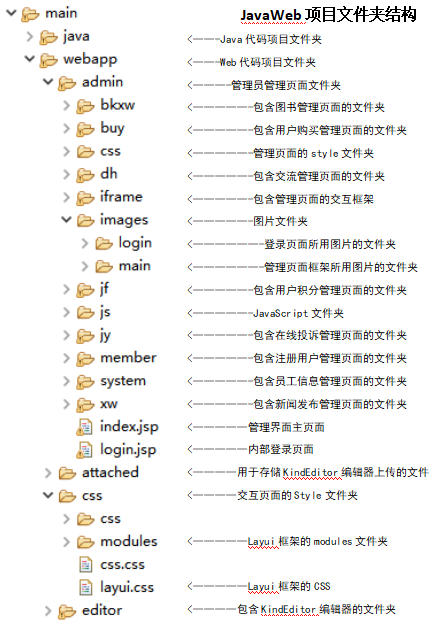
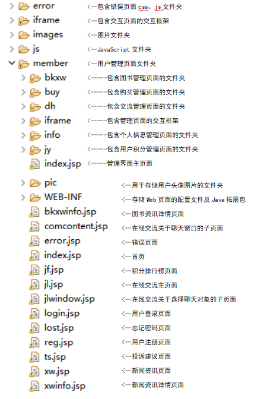

# BookExchangeCommunity

#### 介绍
图书交流网，与读者共享阅读的乐趣！

#### 软件架构

- 本项目运用JSP、Servlet、JDBC、MySQL等计算机开发技术，并结合LayUI、JQuery、KingEditor富文本编辑器实现了一系列功能。
- 在Tomcat服务器运行的情况下，通过接入JDBC接口访问数据库，用户可以在交互界面可以实现查询图书资讯、登陆注册、修改密码、浏览用户及管理员发布的图书资讯、用户与其它用户进行一对一的交流、用户与管理员交流及提供建议、查看用户积分排行榜等功能。在管理页面，用户还可以对个人信息进行管理，其中包括用户信息修改，图书信息的增删改查，交流记录管理及在线投诉管理。
- 管理员较用户来说，其管理页面的权限范围更广，除了用户所具有的管理权限，可增删改查的权限有员工信息、新闻公告、用户交流记录、图书信息、用户账单、用户积分、注册用户、在线投诉等。在表单填写有误时，通过JavaScript和Servlet类可以弹出错误提示。（部分代码中有注释相对应实现的功能）

#### 系统结构图

#### 文件架构
  
  

#### 项目总结

    大二下学期忙碌之余开发的，这个项目花了我十几天的时间，为了前端和后端都能呈现出良好的效果，打代码的过程中常常需要调试修改，Layui的部分样式在项目中的呈现并不能让我满意，因此我通过找到不满意的已封装了的css样式粘贴到jsp中进行修改完善，进而覆盖原样式，呈现出我想要的效果。而后端虽然大多对数据库增删查改的代码比较类同，但一遍遍地再按需要修改也比较花费时间和精力，倒也使自己对JavaWeb可以更娴熟运用了。  
    项目主要的问题还是在线交流板块没有用到WebSocket，只是通过数据库进行简单地模拟聊天功能，以及支付功能，MVC设计模式运用得不够娴熟，没有完全分离前后端。

